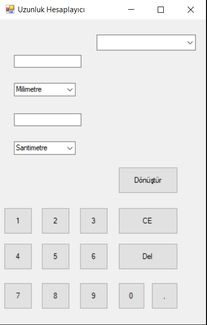
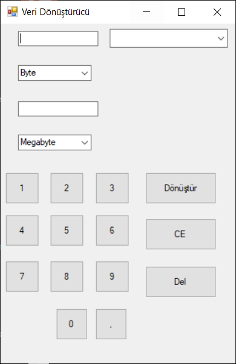

# Awesome Calculator App and Note Taking App
Bu, çok amaçlı bir Windows Form uygulamasıdır. İçinde şu özellikleri barındırır:

- Basit Hesap Makinesi
- Uzunluk Dönüştürücü
- Veri Hesaplayıcı
- Tarih Hesaplayıcı
- Not alma uygulaması

## Ekran Görüntüleri
 

 

## Özellikler

### Basit Hesap Makinesi

- Toplama, çıkarma, çarpma, bölme gibi temel matematiksel işlemlerin yanı sıra mod alma, faktöriyel hesabı, yüzde hesabı, üs hesabı vb işlemleri destekler.
- Temizleme ve geri alma özellikleri.

### Uzunluk Dönüştürücü

- Farklı uzunluk birimleri arasında dönüşüm yapma imkanı.
- Milimetreden kilometreye, inch'ten metreye birçok birimi destekler.

### Veri Hesaplayıcı

- Veri dönüşümü için kullanılır.
- Byte, kilobyte, megabyte gibi birimler arasında dönüşüm yapabilir.

### Tarih Hesaplayıcı

- İki tarih arasındaki farkı hesaplamak için kullanılır.
- Gün, saat, dakika cinsinden farkı gösterir.
